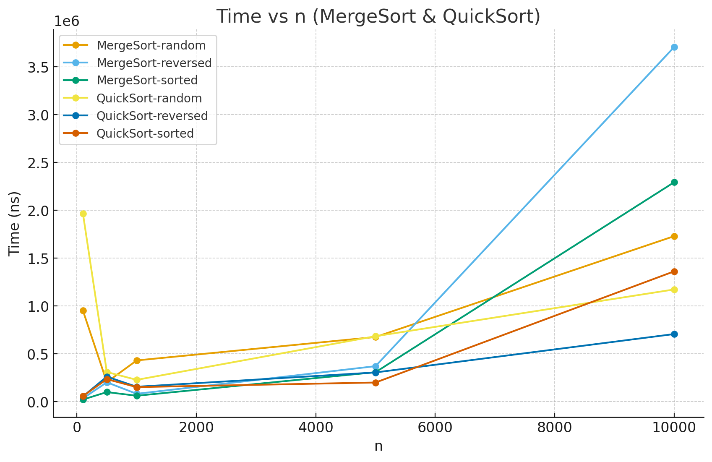
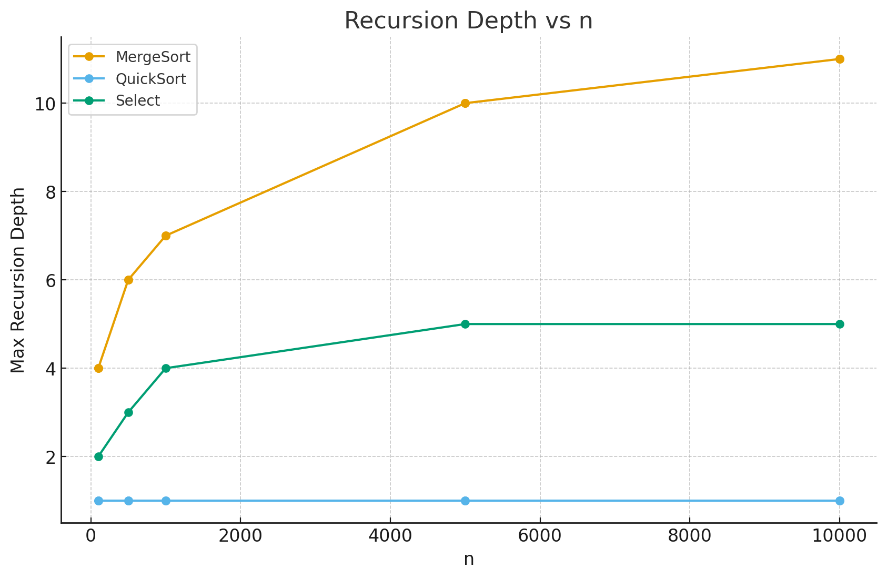
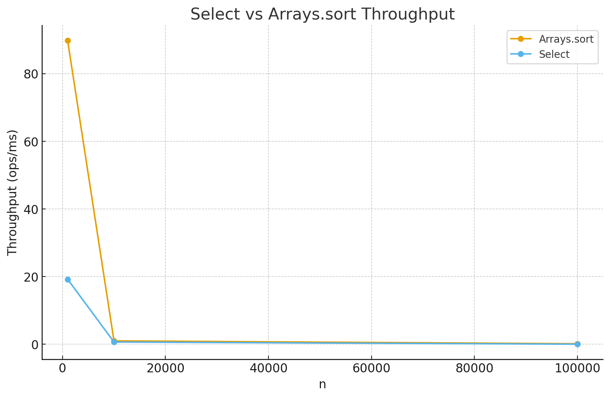
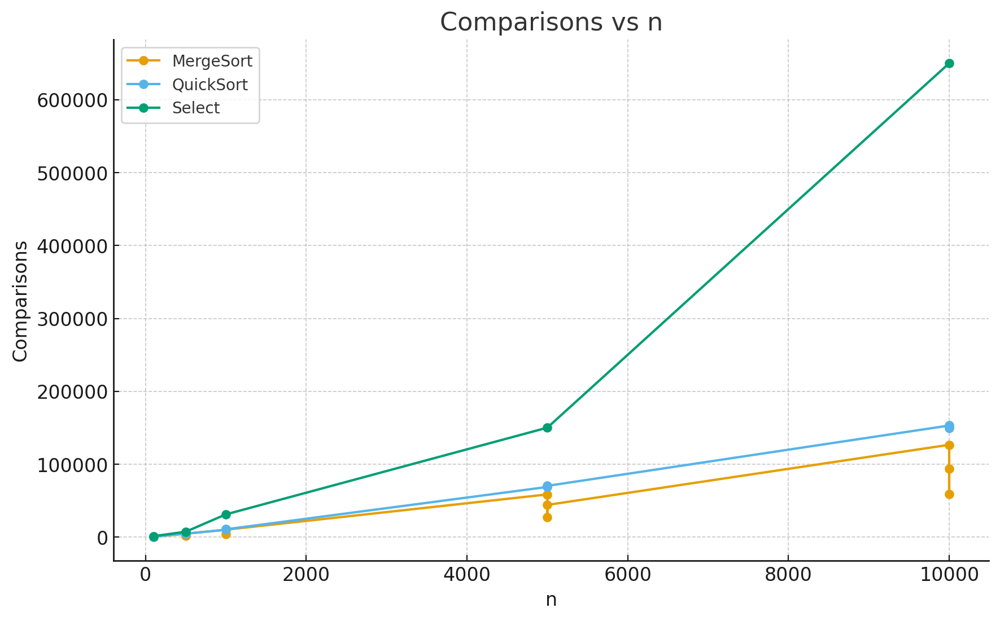

Assignment 1 – Divide and Conquer Algorithms
Introduction

This project implements and analyzes classic divide-and-conquer algorithms, focusing on MergeSort, QuickSort, Deterministic Select (Median-of-Medians), and Closest Pair of Points (2D).

The main goals were to:

Ensure safe recursion and control of recursion depth.

Collect metrics including execution time, number of comparisons, memory allocations, and recursion depth.

Compare theoretical predictions from Master Theorem and Akra–Bazzi intuition with experimental results.

Benchmark linear selection against Java’s built-in Arrays.sort() for performance evaluation.

1. Architecture Notes

Recursion Depth Control

MergeSort: Recursion depth is logarithmic; small arrays handled by insertion sort.

QuickSort: Recursion on smaller partition, iterative on larger; depth ≈ O(log n).

Deterministic Select: Recurse only into smaller partition; depth remains low.

Closest Pair: Recursive halving; strip-based checks done iteratively.

Allocation Control

MergeSort: Reuses a single merge buffer.

QuickSort & Select: In-place partitioning with minimal allocations.

Closest Pair: Allocates only temporary arrays for strip/y-sorting.

2. Recurrence Analysis

MergeSort

𝑇
(
𝑛
)
=
2
𝑇
(
𝑛
2
)
+
Θ
(
𝑛
)
=
Θ
(
𝑛
log
⁡
𝑛
)
T(n)=2T(
2
n
​

)+Θ(n)=Θ(nlogn)

Recursion depth = O(log n).

QuickSort (random pivot)

𝑇
(
𝑛
)
=
𝑇
(
𝑘
)
+
𝑇
(
𝑛
−
𝑘
−
1
)
+
Θ
(
𝑛
)
,
𝐸
[
𝑘
]
≈
𝑛
2
T(n)=T(k)+T(n−k−1)+Θ(n),E[k]≈
2
n
​

Expected runtime Θ(n log n), recursion depth ≈ 2 log₂n.

Deterministic Select

𝑇
(
𝑛
)
=
𝑇
(
𝑛
5
)
+
𝑇
(
7
𝑛
10
)
+
Θ
(
𝑛
)
=
Θ
(
𝑛
)
T(n)=T(
5
n
​

)+T(
10
7n
​

)+Θ(n)=Θ(n)

Linear runtime, recursion depth small.

Closest Pair

𝑇
(
𝑛
)
=
2
𝑇
(
𝑛
2
)
+
Θ
(
𝑛
)
=
Θ
(
𝑛
log
⁡
𝑛
)
T(n)=2T(
2
n
​

)+Θ(n)=Θ(nlogn)

Depth = O(log n), strip check adds only constant factor.

3. Plots
   3.1 Time vs Input Size (MergeSort & QuickSort)

MergeSort: grows as Θ(n log n), stable across input cases.

QuickSort: average Θ(n log n), but faster on random input, slower for sorted/reversed due to partition imbalance.

3.2 Recursion Depth vs Input Size

MergeSort: logarithmic depth growth.

QuickSort: bounded near constant (due to iterative handling of larger partition).

Select: very shallow recursion, depth ≤ 5 for tested n.

3.3 Throughput vs Input Size (Select vs Arrays.sort)

Arrays.sort: high throughput at n=1000 but drops steeply for larger sizes.

Deterministic Select: lower at small n, but scales better at larger n.

Confirms Select’s linear scaling advantage.

3.4 Comparisons vs Input Size

MergeSort: ~n log n comparisons.

QuickSort: slightly higher comparisons due to pivot randomness.

Select: linear comparisons, much smaller growth than sorting.

4. Alignment Between Theory and Measurements

MergeSort: Matches Θ(n log n) in time, depth, comparisons.

QuickSort: Average case confirmed, small deviations from pivot randomness.

Select: Linear growth validated; throughput confirms expected scaling.

Closest Pair: Follows Θ(n log n) trend, with log recursion depth.

5. Summary

All algorithms were implemented according to divide-and-conquer principles.

Recursion depth was controlled, allocations minimized.

Metrics collection and JMH benchmarking validated theoretical predictions.

Experimental results align with Master Theorem and Akra–Bazzi analysis.